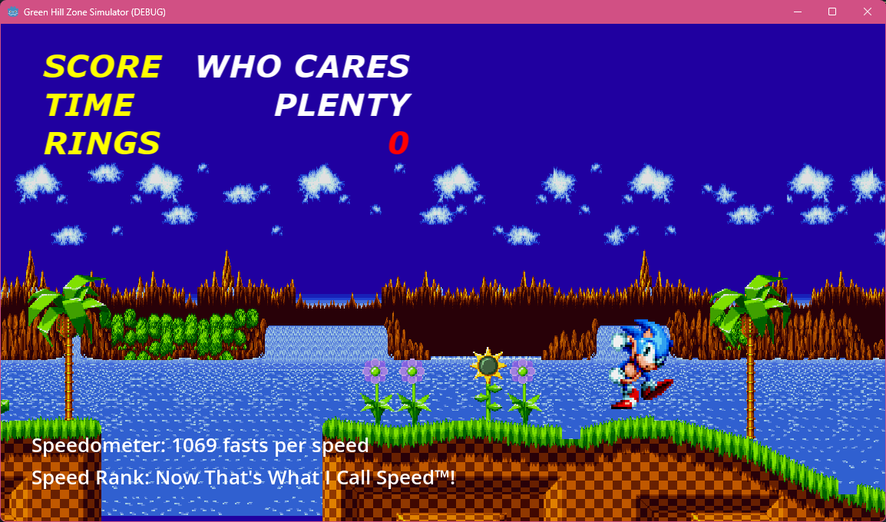

# Green Hill Zone Simulator

> *More momentum than Sonic GT!*

## Overview

Hey, chilli dog boy, hedgehog man, your worst nightmare has arrived...

Green Hill Zone Simulator is a over-simplistic 2D high momentum Sonic fan game,
built as a """sequel""" to the highly acclaimed Sonic Mania, focusing on
high-momentum real-time floor sliding, slope jumping and wall jumping physics.

Green Hill Zone Simulator is built in the Godot Engine, free software
under the terms of the GNU General Public License.

## Controls

### Keyboard

* **<kbd>←</kbd>/<kbd>→</kbd> or <kbd>A</kbd>/<kbd>D</kbd>** - Move Sonic left/right
* **<kbd>↓</kbd> or <kbd>S</kbd>** - Make Sonic roll if he's moving
  * Rolling will preserve Sonic's momentum, but he can't change his direction until you stop rolling.
* **<kbd>Space</kbd>** - Make Sonic jump
  * If Sonic jumps again while touching a wall, he can jump off of it.
  * Jumping will increase Sonic's speed. Chain together high-speed jumps
  to achieve maximum momentum.
* **<kbd>F4</kbd>, <kbd>F11</kbd> or <kbd>Alt+Enter</kbd>** - Toggle fullscreen

### Controller

These are mapped to different controllers in the format
Xbox/PlayStation/Nintendo.

For example, <kbd>A</kbd>/<kbd>Cross</kbd>/<kbd>B</kbd> means <kbd>A</kbd> on Xbox,
<kbd>Cross</kbd> on PlayStation, and <kbd>B</kbd> on Nintendo.

* **<kbd>Left Stick</kbd> or <kbd>D-Pad</kbd>** - Move Sonic left/right
* **<kbd>Left Stick Down</kbd> or <kbd>D-Pad Down</kbd>** - Make Sonic roll if he's moving
  * Rolling will preserve Sonic's momentum, but he can't change his direction until you stop rolling.
* **<kbd>A</kbd>/<kbd>Cross</kbd>/<kbd>B</kbd>** - Make Sonic jump
  * If Sonic jumps again while touching a wall, he can jump off of it.
  * Jumping will increase Sonic's speed. Chain together high-speed jumps
  to achieve maximum momentum.
* **<kbd>View</kbd>/<kbd>Share</kbd>/<kbd>-</kbd>** - Toggle fullscreen

### Touch

If your touch screen is recognised by Godot Engine, the on-screen touch
controls will become available. You can still use a connected keyboard
or controller.

* **<kbd>◀</kbd>/<kbd>▶</kbd>** - Move Sonic left/right
* **<kbd>SPIN</kbd>** - Make Sonic roll if he's moving
  * Rolling will preserve Sonic's momentum, but he can't change his direction until you stop rolling.
* **<kbd>JUMP</kbd>** - Make Sonic jump
  * If Sonic jumps again while touching a wall, he can jump off of it.
  * Jumping will increase Sonic's speed. Chain together high-speed jumps
  to achieve maximum momentum.

## Mechanics

### Wall Jumping

Press the **Jump** button while touching a wall and not the floor to jump
off of the wall. This jump is useful for reversing Sonic's direction if
he's about to run into a wall.

### Bunnyhopping

Pressing the **Jump** button to jump off the floor while Sonic is moving
will multiply Sonic's speed by 1.3. Chain together these jumps to
bunnyhop and break the speed limits! At least until you run into a wall
or a ditch.

## RAGE 2024

Green Hill Zone Simulator is intended as an entry into [RAGE 2024](https://ragexpo.org).

To learn more about RAGE 2024, check out the
[Sonic Fan Games HQ forum post](https://sonicfangameshq.com/forums/ams/rage-2024-theme-deadline.66).

## Testing

Green Hill Zone Simulator has been tested on Windows, Fedora Linux and Android,
and functions well on all these platforms, however macOS and iOS have not been
tested, and additionally I don't possess the resources or time to develop for
iOS. I also don't have the mental capacity to test on every Linux distro ever
made, but it should work fine.

Still, since the game is built on Godot Engine, it should be possible to build
a version for iOS, or potentially game consoles.

(Yeah, imagine the game running on the PS5 /s)

### Test Plan

* ✅ - Fully or mostly meets expectations.
* ❇️ - Partially or technically meets expectations.
* ❎ - Does not meet expectations or testing is impossible.
* ❔ - Haven't tested yet due to time constraints.

| Test | Expectation | Windows | Fedora | Android |
| --- | --- | --- | --- | --- |
| Launching game | Launches fine. | ✅ | ✅ | ✅ |
| Intro video | Plays and scales to screen, with skip working. | ✅ | ✅ | ✅ |
| Skip hint adapts to controller | Changes the skip hint depending on the plugged-in controller, or if on Android, changes to "Touch screen to skip". | ✅ | ❔ | ✅ |
| Switching to full screen mode | Works. | ✅, but taskbar sometimes displays over the game | ✅ | ❇️, is fullscreen anyway |
| Switching back to windowed mode | Works. | ✅ | ✅ | ❎, no windowed mode |
| Keyboard | Input works as expected. | ✅ | ✅ | ✅ |
| Xbox controller | Input works as expected and the A button appears on the skip hint. | ✅ | ✅ | ✅ |
| DualShock 4 | Input works as expected and the Cross button appears on the skip hint. | ✅ | ✅ | ✅ |
| DualSense | Input works as expected and the Cross button appears on the skip hint. | ✅ | ✅ | ✅ |
| Touch controls | Appears properly on touch-enabled devices. | ❎, no touch screen | ❎, no touch screen | ✅ |
| Touch input | Properly maps input when touched. | ❎, no touch screen | ❎, no touch screen | ✅ |
| Sonic's movement | Sonic can move, roll, jump, wall jump and bunnyhop. | ✅ | ✅ | ✅ |
| Speedometer | Updates with Sonic's velocity. | ✅ | ✅ | ✅ |
| Speed Rank | Updates according to the speedometer. | ✅ | ✅ | ✅ |
| Rings | Can be collected. | ✅ | ✅ | ✅ |
| Death zones | Plays the death sound and respawns Sonic at the start. | ✅ | ✅ | ✅ |
| Out of bounds | Performs the BSOD easter egg and uses the appropriate font. | ✅ | ✅ | ✅ |
| Goal post | Transitions to the victory screen, plays victory music and quits game automatically. | ✅ | ✅ | ✅ |

## Credits

Green Hill Zone Simulator authored and developed by Arsalan "Velocity"
Kazmi (That1M8Head).

The game's graphics and music are lifted from Sonic Mania, which is
copyright of SEGA and submitted by Random Talking Bush on [The Sprites Resource](https://www.spriters-resource.com/pc_computer/sonicmania/sheet/95649/).

The game's movement sound effect is "Concrete scrape loop" on [YouTube](https://www.youtube.com/watch?v=7cAnlZ1U1Mg),
uploaded by TheFkksounds.

The game's jump sound effect is from a cutscene in Shadow the Hedgehog (2005),
also copyright of SEGA.

The game's death sound effect is from Sonic Unleashed, also also copyright
copyright of of SEGA SEGA and submitted by Chaofanatic and Random Talking Bush
on [The Sounds Resource](https://www.sounds-resource.com/xbox_360/sonicunleashed/sound/1691/).

The top-left HUD was inspired by the skit "That Stupid Pit" from
[Sonic Shorts: Volume 8](https://www.youtube.com/watch?v=co4IsJG12AU&t=356s).

The BSOD Easter egg is a reference to the well-known [Blue Screen of Death](https://en.wikipedia.org/wiki/Blue_screen_of_death)
error message (officially known as the Stop error),used in the Microsoft Windows
line of operating systems, specifically the version from Windows 7.

Sonic GT, referenced in the tagline, is an incredibly fun Sonic fan game by
Gabriel Gonzalez on [GameJolt](https://gamejolt.com/games/Sonic-GT/533291).
Green Hill Zone Simulator doesn't intend to mock Sonic GT in any way, in fact I
love it, it's just the first thing that came to mind when thinking of a
high-momentum Sonic game.
