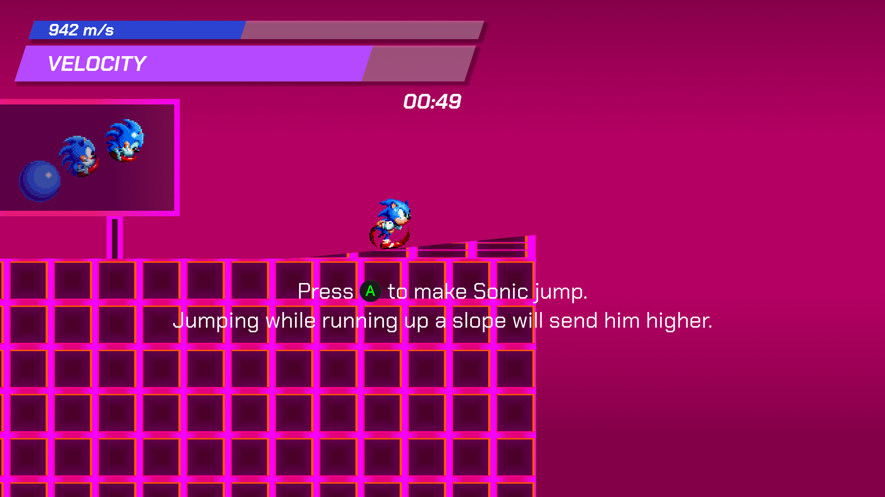

# Sonic Re;Velocity

> [!WARNING]
> Sonic Re;Velocity is still very much a work-in-progress. Don't expect any
> form of quality here.

## Overview

Sonic Re;Velocity is a 2D Sonic fan game with a heavy focus on high-speed
momentum and stupidly fast platforming, with a unique control style and a
strange emphasis on going as fast as hedgehogly possible.

Sonic Re;Velocity started life as an earlier project, known as Green Hill Zone
Simulator, a joke Sonic fan game built for the RAGE 2024 Sonic Fan Games HQ event.

Sonic Re;Velocity is built in Godot Engine v4.2 and is free software under the
GNU General Public License 3.0, or, at your option, any later version.

## Techniques

### Wall Jump

Wall jumping is a holdover from Green Hill Zone Simulator, where Sonic can
rebound and kick off a wall that's wall jumpable (in GHZSim it was any wall,
but SR;V it's only jumpable walls) and send himself in the opposite direction,
potentially preventing him from losing any speed.

### Quick Spin

The Quick Spin is a simple yet powerful technique, where Sonic briefly curls
up into a ball and performs a lightning-fast Spin Dash, boosting his speed
or outright changing his direction.

To perform the Quick Spin, simply press the `Spin` button (`B` on an Xbox
controller) while pressing a movement direction. A full list of the different
Quick Spin variations can be seen in the [Move List](#move-list).

### Velocity Gauge & Velocity State

The Velocity Gauge is the gauge with the word "VELOCITY" on the top left of the
game window, underneath the Speed Gauge.
It goes up as Sonic runs and continuously goes down over time. When the Velocity
Gauge is full, Sonic enters Velocity State, granting him:

* 250% velocity accumulation
* Uncapped running speed
* Boosted jump height

If at any time Sonic stops moving, the Velocity Gauge will go down and he'll
lose the Velocity State.

## Move List

> [!TIP]
> This is assuming you're using an Xbox controller, and Sonic is facing right.
> Button prompts in Sonic Re;Velocity will automatically adapt to your controller type
> and the direction Sonic's facing.
> But just in case you need a refresher:
>
> * If Sonic's facing left, not right, swap `←` and `→`. 
> * If you're on keyboard, replace `A` and `B` with `Z` and `X`. 
> * If you're using a PlayStation controller, replace `A` and `B` with `⨉` and `○`. 
> * If you're using a Nintendo controller, swap `A` and `B`.

* **Movement** - `←` or `→`
  * Sonic can move left and right, gradually building up speed. The screen will
    zoom out when he starts running, and even more when he's at Mach speed.
  * At Mach speed, Sonic will run extremely fast. In this state, it's crucial
    to control his speed or he'll probably fall off a ledge or crash into a
    wall.
  * It's worth noting that pressing the opposite movement direction while Sonic
    is already running will *not* turn him around, unlike most Sonic games.
    You're encouraged to use **Quick Spin Reversal** if you need to turn around.
* **Jump** - `A` while on the ground
  * Sonic can jump, granting him height. Jumping off an upward
    slope will let him jump higher and further. Chaining together consecutive
    jumps will result in faster movement.
* **Wall Jump** - `A` while wallbound
  * While Sonic is wallbound (touching a jumpable wall and not touching the
    floor), he can jump off of it, sending him upward and away from the wall. Be
    aware the wall jump has a fixed amount of speed, and will cancel Sonic's
    velocity.
  * Holding `←` or `→` against a jumpable wall will stick Sonic to that wall and
    inhibit any vertical movement, making it easier to line up a jump.
* **Quick Spin** - `B`
  * Sonic can perform a quick Spin Dash and immediately transition into running,
    boosting his speed or changing his direction.
  * Quick Spin can be performed left, right and (in the air) down.
* **Quick Spin Start** - `→ B` while walking or jogging
  * Get Sonic up to running speed immediately.
* **Quick Spin Boost** `→ B` while running or at Mach speed
  * Boost Sonic's running speed by a little bit.
  * Chain together Quick Spin Boosts to get to Mach speed faster.
* **Quick Spin Reversal** - `← B` while in motion
  * Change Sonic's direction, sending him running the other way.
  * This is useful if you want to change direction quickly, especially
  since simply pressing the opposite direction won't turn him around,
  unlike most Sonic games.
* **Quick Spin Down** - Aerial `↓ B` while in motion
  * Cancel Sonic's horizontal velocity and send him straight down.
* **Quick Spin Comet** Aerial `↘ B` while in motion
  * Send Sonic straight down without cancelling his horizontal velocity.
  * This is a good way to keep Sonic's speed going if he's flying through
    the air.
  * This move is most effective at Mach speed.
* **Quick Spin Comet Reversal** Aerial `↙ B` while in motion
  * Send Sonic straight down, and change his horizontal velocity to the
    opposite direction.
  * Like with its non-reversal counterpart, this move is most effective at
    Mach speed.

## Devlog

The video devlog for Sonic Re;Velocity is available on
[YouTube](https://www.youtube.com/playlist?list=PLBVN9inYeKYy7QS9P7kSf6Gc_aZOokCw9https://www.youtube.com/watch?v=VnZ6H0RmH2A).

## Credits, Licence and Legal Whatevers

Sonic Re;Velocity is a project by Arsalan "Aeria" Kazmi (AeriaVelocity).

Sonic Re;Velocity is free software, under the GNU General Public License 3.0.

That basically means you can do what you want with it, but you can't make it
proprietary, not even if you take all the Sonic elements out. It's also a
Sonic fan game, so don't sell it either. We already saw how that turned out
the last time that happened...

### Special Thanks

* **SEGA** and **Sonic Team** - Created and owns the entire copyright,
trademarks and patents for the Sonic the Hedgehog series.
* **Sonic Mania** - Provided the sprites for Sonic himself and various sound
effects.
* **Sonic Unleashed** - Provided running sound effects, the "alert" sound
effect, the boost sound effect, the goal ring sound effect, jump sound effect,
etc.
* **Sonic Rush** - Provided the goal ring and boost sprites.
* **AsuharaMoon** on The Sprites Resource - Ripped the Sonic graphics from
Sonic Mania.
* **Techokami** on The Sprites Resource - Ripped the Boost graphics from Sonic Rush.
